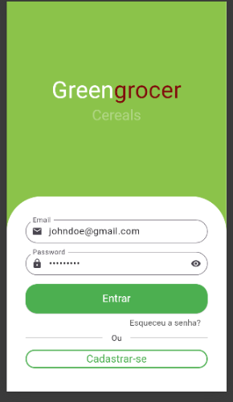

# App Quitanda

Apk mobile feito em:  
<b>Flutter</b>   
<b>Dart</b>   

## Objetivo:
- Estudar o GetX   para gerenciamento de controle de estado, injeção de dependência e claro, simplificar a navegação das rotas 😙 📍 

## Funcionalidades

- **Autenticação de Usuário:**
  - Cadastro de novos usuários.
  - Login e logout.
  - Recuperação de senha via email.

- **Navegação e Interface:**
  - Tela inicial com categorias de produtos.
  - Pesquisa de produtos por nome.
  - Detalhes do produto com imagens, descrições e preços.

- **Gerenciamento de Carrinho:**
  - Adição e remoção de produtos no carrinho.
  - Atualização de quantidades de itens.
  - Visualização do resumo do pedido.

- **Processamento de Pedidos:**
  - Finalização de compras com opções de pagamento, incluindo Pix.
  - Geração de QR Code para pagamentos via Pix.
  - Acompanhamento do status dos pedidos.
  - Histórico dos pedidos.
 
  ## Imagens:
  
  

  
   

  Demais imagens estão presentes na 📁 prints! 😄

